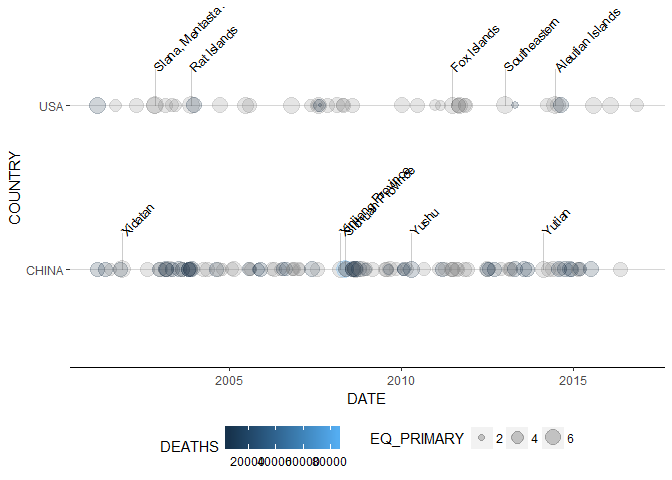

noaamsdr
============

[](https://travis-ci.org/rhkaz/noaamsdr)

[Building details](https://travis-ci.org/rhkaz/noaamsdr)

The goal of NOAACoursera is to create a package to manipulate and analyze the eartquakes [NOAA dataset](NOAA). This project corresponds to the capstone project of the "Mastering Software Development in R" Coursera's specialization.

Installation
------------

This is a basic example which shows you how to solve a common problem:

``` r
devtools::install_github("rhkaz/noaamsdr")
```

Usage
-----

The package currently contains functions to:

-   Get the dataset
-   Clean the variables
-   Visualize a timeline of the earthquakes
-   Visualize a map with the epicenters

### Get data

This package will download and put the data in a persistent directory unless you specify another path. Just write

``` r
library(tidyverse)
#> Loading tidyverse: ggplot2
#> Loading tidyverse: tibble
#> Loading tidyverse: tidyr
#> Loading tidyverse: readr
#> Loading tidyverse: purrr
#> Loading tidyverse: dplyr
#> Conflicts with tidy packages ----------------------------------------------
#> filter(): dplyr, stats
#> lag():    dplyr, stats
library(lubridate)
#> 
#> Attaching package: 'lubridate'
#> The following object is masked from 'package:base':
#> 
#>     date
library(noaamsdr)
eq_get_data() %>% glimpse
#> Observations: 5,934
#> Variables: 47
#> $ I_D                                <chr> "1", "3", "2", "5877", "8",...
#> $ FLAG_TSUNAMI                       <chr> NA, NA, "Tsu", "Tsu", NA, N...
#> $ YEAR                               <chr> "-2150", "-2000", "-2000", ...
#> $ MONTH                              <chr> NA, NA, NA, NA, NA, NA, NA,...
#> $ DAY                                <chr> NA, NA, NA, NA, NA, NA, NA,...
#> $ HOUR                               <chr> NA, NA, NA, NA, NA, NA, NA,...
#> $ MINUTE                             <chr> NA, NA, NA, NA, NA, NA, NA,...
#> $ SECOND                             <chr> "    ", NA, NA, NA, "    ",...
#> $ FOCAL_DEPTH                        <chr> NA, "18", NA, NA, NA, NA, N...
#> $ EQ_PRIMARY                         <chr> " 7.3", " 7.1", NA, NA, NA,...
#> $ EQ_MAG_MW                          <chr> NA, NA, NA, NA, NA, NA, NA,...
#> $ EQ_MAG_MS                          <chr> NA, " 7.1", NA, NA, NA, NA,...
#> $ EQ_MAG_MB                          <chr> NA, NA, NA, NA, NA, NA, NA,...
#> $ EQ_MAG_ML                          <chr> NA, NA, NA, NA, NA, NA, NA,...
#> $ EQ_MAG_MFA                         <chr> NA, NA, NA, NA, NA, NA, NA,...
#> $ EQ_MAG_UNK                         <chr> " 7.3", NA, NA, NA, NA, NA,...
#> $ INTENSITY                          <chr> NA, "10", "10", NA, "10", "...
#> $ COUNTRY                            <chr> "JORDAN", "TURKMENISTAN", "...
#> $ STATE                              <chr> NA, NA, NA, NA, NA, NA, NA,...
#> $ LOCATION_NAME                      <chr> "JORDAN:  BAB-A-DARAA,AL-KA...
#> $ LATITUDE                           <chr> "  31.100", "  38.000", "  ...
#> $ LONGITUDE                          <chr> "   35.500", "   58.200", "...
#> $ REGION_CODE                        <chr> "140", "40", "130", "130", ...
#> $ DEATHS                             <chr> NA, "       1", NA, NA, NA,...
#> $ DEATHS_DESCRIPTION                 <chr> NA, "1", "3", NA, NA, NA, N...
#> $ MISSING                            <chr> NA, NA, NA, NA, NA, NA, NA,...
#> $ MISSING_DESCRIPTION                <chr> NA, NA, NA, NA, NA, NA, NA,...
#> $ INJURIES                           <chr> NA, NA, NA, NA, NA, NA, NA,...
#> $ INJURIES_DESCRIPTION               <chr> NA, NA, NA, NA, NA, NA, NA,...
#> $ DAMAGE_MILLIONS_DOLLARS            <chr> NA, NA, NA, NA, NA, NA, NA,...
#> $ DAMAGE_DESCRIPTION                 <chr> "3", "1", NA, NA, "3", NA, ...
#> $ HOUSES_DESTROYED                   <chr> NA, NA, NA, NA, NA, NA, NA,...
#> $ HOUSES_DESTROYED_DESCRIPTION       <chr> NA, "1", NA, NA, NA, NA, NA...
#> $ HOUSES_DAMAGED                     <chr> NA, NA, NA, NA, NA, NA, NA,...
#> $ HOUSES_DAMAGED_DESCRIPTION         <chr> NA, NA, NA, NA, NA, NA, NA,...
#> $ TOTAL_DEATHS                       <chr> NA, "       1", NA, NA, NA,...
#> $ TOTAL_DEATHS_DESCRIPTION           <chr> NA, "1", "3", "3", NA, NA, ...
#> $ TOTAL_MISSING                      <chr> NA, NA, NA, NA, NA, NA, NA,...
#> $ TOTAL_MISSING_DESCRIPTION          <chr> NA, NA, NA, NA, NA, NA, NA,...
#> $ TOTAL_INJURIES                     <chr> NA, NA, NA, NA, NA, NA, NA,...
#> $ TOTAL_INJURIES_DESCRIPTION         <chr> NA, NA, NA, NA, NA, NA, NA,...
#> $ TOTAL_DAMAGE_MILLIONS_DOLLARS      <chr> NA, NA, NA, NA, NA, NA, NA,...
#> $ TOTAL_DAMAGE_DESCRIPTION           <chr> NA, "1", NA, "3", NA, NA, "...
#> $ TOTAL_HOUSES_DESTROYED             <chr> NA, NA, NA, NA, NA, NA, NA,...
#> $ TOTAL_HOUSES_DESTROYED_DESCRIPTION <chr> NA, "1", NA, NA, NA, NA, NA...
#> $ TOTAL_HOUSES_DAMAGED               <chr> NA, NA, NA, NA, NA, NA, NA,...
#> $ TOTAL_HOUSES_DAMAGED_DESCRIPTION   <chr> NA, NA, NA, NA, NA, NA, NA,...
```

and you will have the complete raw NOAA dataset in a data.frame object.

### Clean data

By default, all variables are imported as character. This is because we want to make a more robust cleaning of the data. Again, just pass the dataframe to the cleaning data and you will have a clean dataset with the types of each variable corrected and some new variables that compact information (e.g. date column).

``` r
eq_get_data() %>% eq_clean_data %>% head
#> # A tibble: 6 × 45
#>     I_D FLAG_TSUNAMI       DATE  HOUR MINUTE SECOND FOCAL_DEPTH EQ_PRIMARY
#>   <dbl>        <chr>     <date> <dbl>  <dbl>  <dbl>       <dbl>      <dbl>
#> 1    38         <NA> 0010-01-01    NA     NA     NA          18        7.1
#> 2    39         <NA> 0011-01-01    NA     NA     NA          NA         NA
#> 3    40         <NA> 0017-01-01    NA     NA     NA          NA         NA
#> 4    41         <NA> 0023-01-01    NA     NA     NA          NA         NA
#> 5    42         <NA> 0025-01-01    NA     NA     NA          NA         NA
#> 6    43         <NA> 0027-01-01    NA     NA     NA          NA        6.3
#> # ... with 37 more variables: EQ_MAG_MW <dbl>, EQ_MAG_MS <dbl>,
#> #   EQ_MAG_MB <dbl>, EQ_MAG_ML <dbl>, EQ_MAG_MFA <dbl>, EQ_MAG_UNK <dbl>,
#> #   INTENSITY <dbl>, COUNTRY <chr>, STATE <chr>, LOCATION_NAME <chr>,
#> #   LATITUDE <dbl>, LONGITUDE <dbl>, REGION_CODE <dbl>, DEATHS <dbl>,
#> #   DEATHS_DESCRIPTION <dbl>, MISSING <dbl>, MISSING_DESCRIPTION <dbl>,
#> #   INJURIES <dbl>, INJURIES_DESCRIPTION <dbl>,
#> #   DAMAGE_MILLIONS_DOLLARS <dbl>, DAMAGE_DESCRIPTION <dbl>,
#> #   HOUSES_DESTROYED <dbl>, HOUSES_DESTROYED_DESCRIPTION <dbl>,
#> #   HOUSES_DAMAGED <dbl>, HOUSES_DAMAGED_DESCRIPTION <dbl>,
#> #   TOTAL_DEATHS <dbl>, TOTAL_DEATHS_DESCRIPTION <dbl>,
#> #   TOTAL_MISSING <dbl>, TOTAL_MISSING_DESCRIPTION <dbl>,
#> #   TOTAL_INJURIES <dbl>, TOTAL_INJURIES_DESCRIPTION <dbl>,
#> #   TOTAL_DAMAGE_MILLIONS_DOLLARS <dbl>, TOTAL_DAMAGE_DESCRIPTION <dbl>,
#> #   TOTAL_HOUSES_DESTROYED <dbl>,
#> #   TOTAL_HOUSES_DESTROYED_DESCRIPTION <dbl>, TOTAL_HOUSES_DAMAGED <dbl>,
#> #   TOTAL_HOUSES_DAMAGED_DESCRIPTION <dbl>
```

### Visualize a timeline of the dataset

It could be useful to visualize the earthquakes across time and other variables This is implemented in a couple of ggplot2's geoms:

``` r
df <- eq_get_data() %>%
  eq_clean_data %>%
  filter(!is.na(EQ_PRIMARY)) %>%
  filter(year(DATE) > 2000) %>%
  filter(COUNTRY %in% c("CHINA", "USA"))
ggplot(df) +
  aes(
    x = DATE,
    y = COUNTRY,
    size = EQ_PRIMARY,
    colour = DEATHS,
    label = LOCATION_NAME,
    by = EQ_PRIMARY
  ) +
  geom_timeline() +
  geom_timeline_label(n_max = 5) +
  theme_timeline
```



### Visualize the earthquakes in a map

A leaflet wrapper is implemented to easily visualize the epicenters:

``` r
eq_get_data() %>%
  eq_clean_data %>%
  filter(COUNTRY == "MEXICO", year(DATE) >= 2000) %>%
  eq_map(annot_col = "DATE")

eq_get_data() %>%
  eq_clean_data %>%
  filter(COUNTRY == "MEXICO", year(DATE) >= 2000) %>%
  mutate(popup_text = eq_create_label(.)) %>%
  eq_map(annot_col = "popup_text")
```

References
----------

-   National Geophysical Data Center / World Data Service (NGDC/WDS): Significant Earthquake Database. National Geophysical Data Center, NOAA. <doi:10.7289/V5TD9V7K>
